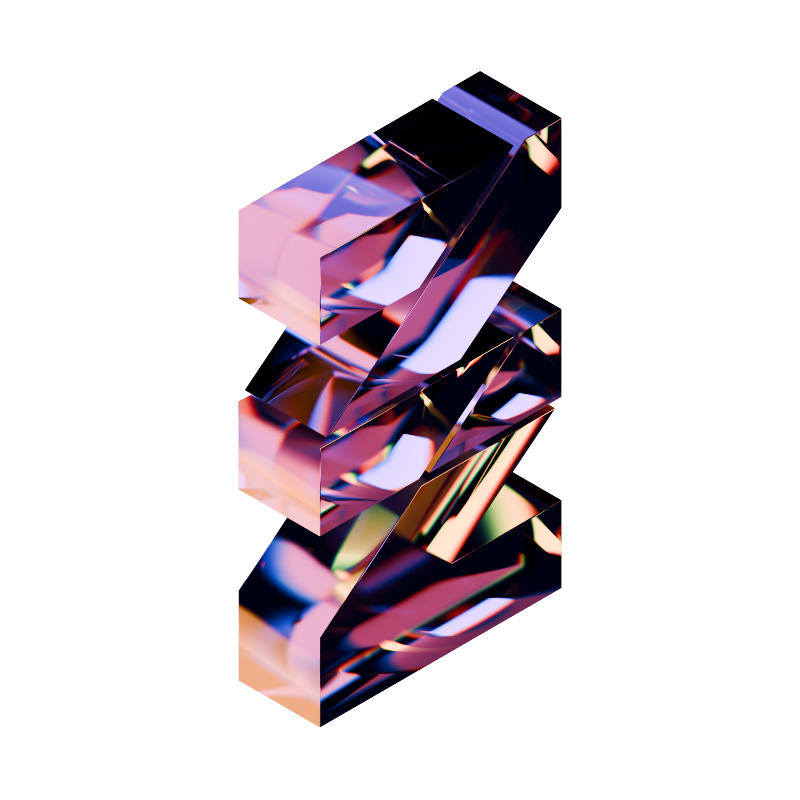

    

export const link =
info => {
    const [_, folder, name, desc] = /^(@?[\w.-]+\/)?([\w.-]+)(?: *: *(.+))?$/.exec(info)
    const host = `https://github.com`
    return ``
        + (folder
            ? `- [${name}](${host}/${
                folder.startsWith("@")
                    ? folder.slice(1)
                    : "gnlow-"+folder
            }${name})`
            : `- [${name}](${host}/gnlow/${name})`)
        + (desc ? `: ${desc}` : ``)
}

export const links =
([str]) =>
    str.trim().split("\n").map(x => link(x.trim())).join("\n")

### Programming Language
{links`
    @flark-lang/flark: Flexbox-first Markup Langauge (2023)
    @zyland/Zy.js: Pattern Generating Markup Language (2023)
    Qae: Toy Programming Language, to Learn Assembly (2025)
`}

### Procedural Generation
{links`
    @randkid/Randkid: Random Profile Generator (2020-2021)
    Od: Knotty Neography (2023)
    planet-generator-w: Planet Generator, powered by WebGPU (2025)
`}

### Educational Programming Environment
{links`
    Jevi: [Obsolete] Realtime Communication in EntryJS (2018-2019)
    Ent2ml: [Obsolete] Stat Viewer Website for playentry.org (2019-2020)
    @dalkak2/enz: EntryJS Project Transpiler (2023)
    @dalkak2/enz-pixi: [WIP] Performant EntryJS Runtime (2023-2025)
    Entry-compat-table: (2023-2024)
`}

### Deno Sidekick
{links`
    tsm: CDN<TS => JS> (2023)
    tserve: file_server + deno_emit (2023-2025)
    xmd: MDX -> MD (2023)
    gsheet.deno.dev: Load Google Sheets as CSV (2024)
`}

### Utility
{links`
    twilight.js: Twilight Colormap for JS (2024)
    lilgpu: Lil Wrapper to Toy with WebGPU (2025)
    kml.ts: [WIP] KML Parser (2025)
`}

### Web App
{links`
    naganaga: Spreadsheet-integrated Dictionary (2024)
`}

### Userscript
{links`
    c4: (2020)
    yt-unlister: (2025)
`}
